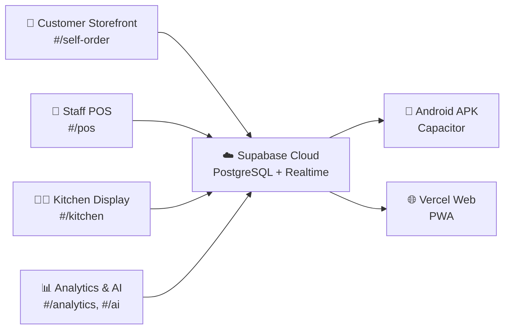
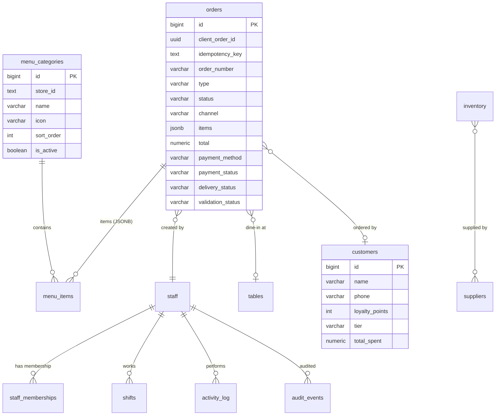
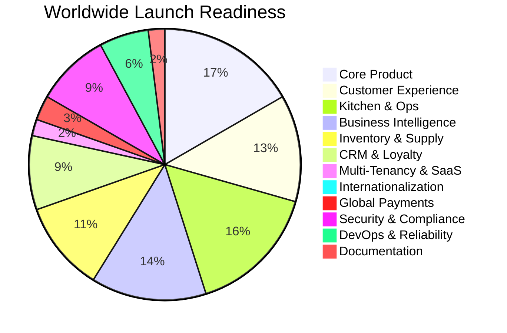

# 🍜 NextGenOS Restaurant Operating System — Platform Blueprint

> **Codebase**: `d:\Zeaul\Restraunt` — **"The Taste"** Restaurant OS  
> **Version**: 2.0.0 · **Brand**: NextGenOS  
> **Live Domain**: [thetaste.co.in](https://thetaste.co.in) · **APK**: `TheTaste.apk`  
> **Analysis Date**: 27 May 2026

---

## 1. What Is This Platform?

**NextGenOS Restaurant Operating System** is a **full-stack, online-first, offline-capable restaurant management platform** that combines a customer-facing online ordering storefront with a staff-facing operations backend — all running as a single Progressive Web App (PWA) and Android APK.

### The Core Concept



It is designed for **small-to-medium restaurants in India** (specifically "The Taste — Fast Food & Chinese"), but the architecture uses a `store_id` tenant model making it **multi-tenant ready** for a worldwide SaaS launch.

### Dual-Portal Architecture

| Portal | Route | Audience | Auth Required |
|--------|-------|----------|---------------|
| **Customer Storefront** | `#/self-order` | Public customers | ❌ No |
| **Staff Operations** | `#/pos`, `#/kitchen`, `#/analytics`, etc. | Restaurant staff | ✅ PIN or Cloud Auth |

---

## 2. Technology Stack

| Layer | Technology | Purpose |
|-------|-----------|---------|
| **Frontend** | Vanilla JS (ES Modules) + Vite | Zero-framework SPA with code-splitting |
| **Styling** | Vanilla CSS (7 stylesheets, ~113KB) | Dark mode glassmorphism design system |
| **Local Database** | Dexie.js (IndexedDB) | Offline cache behind the online-first read path (8 schema versions) |
| **Cloud Database** | Supabase (PostgreSQL) | Source of truth for every read, RLS, Realtime sync |
| **Auth** | Dual: PIN-based (SHA-256) + Supabase Auth | Staff authentication with RBAC |
| **Sync Engine** | Custom bidirectional sync service (1,722 lines) | Offline→Cloud with exponential backoff |
| **Edge Functions** | Supabase Edge Functions (Deno) | Server-side order validation |
| **PWA** | vite-plugin-pwa + Workbox | Offline caching, install prompt |
| **Mobile** | Capacitor (Android APK) | Native Android wrapper |
| **Deployment** | Vercel (Web) + Manual APK build | CDN hosting with security headers |
| **Payments** | UPI QR generation (qrcode.js) | Manual UPI verification flow |
| **Printing** | Web Bluetooth ESC/POS | Thermal receipt printing |
| **Testing** | Playwright (E2E) + Node test runner | Automated browser + unit tests |

---

## 3. Architecture Blueprint

### 3.1 Directory Structure

```
Restraunt/
├── index.html                    # SPA entry point
├── src/
│   ├── main.js                   # App bootstrap (735 lines)
│   ├── router.js                 # Hash-based SPA router with RBAC
│   ├── components/
│   │   ├── LoginScreen.js        # PIN + Cloud auth login
│   │   ├── FirstRunSetup.js      # Initial owner setup wizard
│   │   └── Sidebar.js            # Navigation sidebar
│   ├── views/
│   │   ├── pos/                  # Point of Sale (POS terminal)
│   │   ├── kitchen/              # Kitchen Display System (KDS)
│   │   ├── tables/               # Table management & floor plan
│   │   ├── customer/             # Public customer ordering (57KB!)
│   │   ├── channels/             # Multi-channel order hub
│   │   ├── analytics/            # Business intelligence dashboard
│   │   ├── inventory/            # Stock & supplier management
│   │   ├── customers/            # CRM & loyalty system
│   │   ├── staff/                # Staff & shift management
│   │   ├── ai/                   # AI command center
│   │   └── admin/                # Admin, menu manager, order history, settings
│   ├── services/
│   │   ├── sync.js               # Cloud sync engine (1,722 lines!)
│   │   ├── auth.js               # Authentication service
│   │   ├── ai.js                 # AI analytics assistant
│   │   ├── receipt.js            # ESC/POS receipt builder
│   │   ├── printer.js            # Web Bluetooth printer
│   │   ├── whatsapp.js           # WhatsApp bill sharing
│   │   ├── upi.js                # UPI QR code generation
│   │   ├── publicOrders.js       # Customer order submission
│   │   ├── supabaseClient.js     # Supabase client factory
│   │   ├── analytics.js          # Analytics data queries
│   │   ├── tables.js             # Table service
│   │   ├── inventory.js          # Inventory service
│   │   ├── inventoryHook.js      # Auto-deduct on order
│   │   ├── reportGenerator.js    # CSV report generator
│   │   └── driveUpload.js        # Google Drive backup
│   ├── db/
│   │   ├── database.js           # Dexie schema (5 versions) + CRUD
│   │   └── seed.js               # Demo data seeder
│   ├── utils/
│   │   ├── helpers.js            # Currency, date, toast, sound
│   │   ├── crypto.js             # SHA-256 PIN hashing
│   │   ├── dataExport.js         # JSON/CSV export
│   │   ├── activityLogger.js     # Activity log helper
│   │   └── watermark.js          # NextGenOS branding
│   └── styles/                   # 7 CSS files (~113KB total)
├── supabase/
│   └── functions/
│       └── public-order/         # Edge function for order validation
├── supabase-schema.sql           # Full PostgreSQL schema (316 lines)
├── android/                      # Capacitor Android project
├── tests/                        # Playwright E2E + unit tests
└── vercel.json                   # Deployment config with CSP headers
```

### 3.2 Data Model (13 Tables)



### 3.3 Data Layer (Online-First)

Supabase is the source of truth for every read. IndexedDB is a cache that
answers only when the cloud cannot be reached — not a parallel copy of the
store that happens to be synced periodically.

| Concern | How it works |
|---------|--------------|
| **Read path** | `ensureFresh(resources)` (`services/cloudDb.ts`) pulls the table from Supabase, hydrates IndexedDB, then the caller reads Dexie as usual |
| **Resource registry** | Each cloud-owned table is described once — query, mapping and local reconciliation rule — and login hydration (`fullPull`) reuses it, so the two paths cannot drift |
| **Cost control** | `services/freshness.ts` shares one query between concurrent callers and reuses a pull for a few seconds, so a screen's cascade of reads costs one query per table |
| **Offline** | An unreachable cloud resolves the read from the cache; nothing throws, and the pull is retried on the next read rather than cached as a success |
| **Reconnect** | Regaining the network (or a realtime channel coming back) retires every freshness window, so the next read goes to Supabase |
| **Writes** | Unchanged: orders are written to the cloud first and refuse to complete offline; other writes replicate through the sync service with an offline queue |

---

### 3.4 Security Architecture

| Feature | Implementation |
|---------|---------------|
| **PIN Authentication** | SHA-256 hashing via Web Crypto API |
| **Cloud Authentication** | Supabase Auth (email/password) |
| **RBAC** | 6 roles: `owner`, `manager`, `cashier`, `kitchen`, `waiter`, `delivery` |
| **Route Guards** | Per-route role whitelists in router |
| **Row Level Security** | Postgres RLS on all 13 tables |
| **Staff Memberships** | `staff_memberships` table ties Supabase Auth → staff roles |
| **Session Management** | 8-hour auto-expiry timer |
| **PIN Lockout** | 5 failed attempts → 5-minute lockout |
| **Rate Limiting** | `public_order_rate_limits` table for customer orders |
| **CSP Headers** | Full Content-Security-Policy in Vercel config |
| **Idempotency** | `client_order_id` + `idempotency_key` prevent duplicate orders |

---

## 4. Existing Feature Map (What's Built)

### ✅ Fully Implemented (13 Modules)

| # | Module | File(s) | Lines | Status |
|---|--------|---------|-------|--------|
| 1 | **Point of Sale (POS)** | `PosView.js`, `CartPanel.js`, `MenuGrid.js`, `PaymentModal.js`, `CheckoutSuccessModal.js` | ~80K | ✅ Full |
| 2 | **Customer Self-Order Storefront** | `CustomerView.js` (1,430 lines) | 57KB | ✅ Full |
| 3 | **Kitchen Display System (KDS)** | `KitchenView.js` | 30KB | ✅ Full |
| 4 | **Table Management** | `TablesView.js` + `tables.js` service | ~10KB | ✅ Full |
| 5 | **Order History & Logs** | `OrderHistory.js` | 19KB | ✅ Full |
| 6 | **Analytics Dashboard** | `AnalyticsDashboard.js` + `analytics.js` | ~29KB | ✅ Full |
| 7 | **AI Command Center** | `AICommandCenter.js` + `ai.js` (14 intents) | ~27KB | ✅ Full |
| 8 | **Inventory & Suppliers** | `InventoryView.js` + `inventory.js` + `inventoryHook.js` | ~21KB | ✅ Full |
| 9 | **Customer CRM & Loyalty** | `CustomersView.js` | 11KB | ✅ Full |
| 10 | **Staff & Shift Management** | `StaffView.js` + `auth.js` | ~28KB | ✅ Full |
| 11 | **Multi-Channel Hub** | `ChannelHub.js` | 8KB | ✅ Full |
| 12 | **Admin & Settings** | `AdminView.js` + `Settings.js` + `MenuManager.js` | ~118KB | ✅ Full |
| 13 | **Cloud Sync Engine** | `sync.js` (1,722 lines!) | 60KB | ✅ Full |

### ✅ Supporting Services

| Service | Purpose | Status |
|---------|---------|--------|
| Thermal Printing (ESC/POS via Bluetooth) | Receipt printing | ✅ |
| UPI QR Code Generation | Payment collection | ✅ |
| WhatsApp Bill Sharing | Customer receipt via wa.me | ✅ |
| CSV Report Generator | Daily/weekly/monthly reports | ✅ |
| Google Drive Backup | Data export to Drive | ✅ |
| PWA + Service Worker | Offline-first, installable | ✅ |
| Android APK (Capacitor) | Native Android app | ✅ |
| Supabase Edge Functions | Server-side order validation | ✅ |
| Activity & Audit Logging | Full audit trail | ✅ |

---

## 5. What Else Should Be Added for Worldwide Launch

### 🔴 Critical (Must-Have Before Launch)

| # | Feature | Why It's Critical | Effort |
|---|---------|-------------------|--------|
| 1 | **Multi-Language (i18n)** | Global customers need local languages | 🔴 High |
| 2 | **Multi-Currency Support** | ₹ is hardcoded everywhere; need USD, EUR, GBP, etc. | 🔴 High |
| 3 | **Multi-Tenant Onboarding** | `store_id` exists but no signup/registration flow | 🔴 High |
| 4 | **Payment Gateway Integration** | Currently UPI-only; need Stripe, PayPal, Razorpay, etc. | 🔴 High |
| 5 | **Tax Engine (GST/VAT/Sales Tax)** | Hardcoded single tax %; need per-region tax rules | 🔴 High |
| 6 | **GDPR/Privacy Compliance** | No consent management, data deletion, or privacy policy | 🔴 High |
| 7 | **Terms of Service & Legal** | No legal framework for SaaS operation | 🔴 Medium |
| 8 | **Email Notification System** | No order confirmations, password resets, or alerts | 🔴 Medium |
| 9 | **Production Error Monitoring** | No Sentry/error tracking in production | 🔴 Medium |
| 10 | **Rate Limiting & DDoS Protection** | Basic IP-hash table exists but no WAF/CDN protection | 🔴 Medium |

### 🟡 Important (Should-Have for Competitive Launch)

| # | Feature | Business Value | Effort |
|---|---------|---------------|--------|
| 11 | **Online Payment Processing** | Accept real card/digital payments online | 🟡 High |
| 12 | **Real-Time Order Tracking (Customer)** | Live map/status tracking for delivery orders | 🟡 High |
| 13 | **Push Notifications** | Order status updates to customer devices | 🟡 Medium |
| 14 | **Multi-Branch Management** | Manage multiple restaurant locations from one dashboard | 🟡 High |
| 15 | **Subscription & Billing System** | SaaS pricing, plan management, invoicing | 🟡 High |
| 16 | **Admin Super-Dashboard** | Platform-wide analytics for all tenants | 🟡 High |
| 17 | **Menu Image Upload** | Currently uses category-mapped stock photos | 🟡 Medium |
| 18 | **Customer Accounts & Order History** | Let customers create accounts and reorder | 🟡 Medium |
| 19 | **Promo Codes & Discounts Engine** | Coupon system for marketing | 🟡 Medium |
| 20 | **SMS/OTP Verification** | Phone number verification for customer orders | 🟡 Medium |
| 21 | **Kitchen Printer Integration** | Auto-print KOTs to kitchen printer | 🟡 Medium |
| 22 | **Reservation System** | Table exists in schema but no UI implemented | 🟡 Medium |
| 23 | **Third-Party Delivery Integration** | Swiggy, Zomato, DoorDash, Uber Eats API integration | 🟡 High |
| 24 | **iOS App (Capacitor)** | Currently Android-only | 🟡 Medium |
| 25 | **Comprehensive API Documentation** | REST/GraphQL API docs for partners | 🟡 Medium |

### 🟢 Nice-to-Have (Post-Launch Enhancements)

| # | Feature | Business Value | Effort |
|---|---------|---------------|--------|
| 26 | **AI-Powered Menu Recommendations** | Use order history to suggest items to customers | 🟢 Medium |
| 27 | **Ingredient-Level Cost Tracking** | Recipe costing linked to inventory | 🟢 Medium |
| 28 | **Customer Reviews & Ratings** | Build social proof | 🟢 Medium |
| 29 | **Multi-Floor Visual Table Map** | Drag-and-drop floor plan editor | 🟢 High |
| 30 | **Loyalty App / Digital Wallet** | Standalone customer loyalty mobile app | 🟢 High |
| 31 | **QR Code Contactless Menu** | Dynamic QR codes per table with live menu | 🟢 Low |
| 32 | **Staff Performance Analytics** | Individual staff metrics & leaderboards | 🟢 Medium |
| 33 | **Waste & Spoilage Tracking** | Track food waste against inventory | 🟢 Medium |
| 34 | **Kitchen Video Display** | Large-screen KDS mode for commercial kitchens | 🟢 Low |
| 35 | **Franchisee Management Portal** | For franchise chains to onboard locations | 🟢 High |

---

## 6. Worldwide Launch Readiness Tracker

### Overall Score: **~38% Complete** 🟡

```
██████████░░░░░░░░░░░░░░░░ 38%
```

### Detailed Breakdown by Launch Pillar

---

#### Pillar 1: Core Product (POS + Orders)
**Status: 85% ✅**
```
█████████████████░░░ 85%
```

| Item | Status | Notes |
|------|--------|-------|
| POS terminal (take orders, process payment) | ✅ Done | Fully functional |
| Menu management (categories, items, veg/non-veg) | ✅ Done | CRUD + cloud sync |
| Order lifecycle (pending → preparing → ready → completed) | ✅ Done | Full state machine |
| Payment: UPI QR generation | ✅ Done | Manual verification |
| Payment: Cash handling | ✅ Done | |
| Thermal receipt printing (ESC/POS Bluetooth) | ✅ Done | |
| Order number generation (prefix + date + sequence) | ✅ Done | Idempotency built in |
| Real payment gateway (Stripe/Razorpay) | ❌ Missing | UPI-only right now |
| Multi-currency support | ❌ Missing | Hardcoded ₹ symbol |
| Tip management | ❌ Missing | |

---

#### Pillar 2: Customer Ordering Experience
**Status: 65% 🟡**
```
█████████████░░░░░░░ 65%
```

| Item | Status | Notes |
|------|--------|-------|
| Public storefront with hero, menu, cart, checkout | ✅ Done | Beautiful UI |
| Delivery / takeaway / dine-in selection | ✅ Done | |
| QR table detection from URL | ✅ Done | `?table=N` param |
| Order confirmation page with live telemetry ring | ✅ Done | Polls every 3s |
| UPI QR on success page | ✅ Done | |
| Customer accounts & login | ❌ Missing | Orders are anonymous |
| Order history for customers | ❌ Missing | No reorder capability |
| Push notification on status change | ❌ Missing | |
| Real-time delivery tracking map | ❌ Missing | |
| Promo codes / discount application | ❌ Missing | |
| Menu item images (custom uploads) | ❌ Missing | Category-based stock photos |
| Customer reviews / ratings | ❌ Missing | |

---

#### Pillar 3: Kitchen & Operations
**Status: 80% ✅**
```
████████████████░░░░ 80%
```

| Item | Status | Notes |
|------|--------|-------|
| Kitchen Display System (KDS) | ✅ Done | Real-time order cards |
| Order status workflow (pending → preparing → ready) | ✅ Done | |
| Table management (status, capacity, floor section) | ✅ Done | |
| Multi-channel order hub | ✅ Done | POS, Kiosk, QR, WhatsApp channels |
| Delivery workflow (assign → dispatch → deliver) | ✅ Done | Full tracking |
| Kitchen printer auto-print (KOT) | ❌ Missing | Manual print only |
| Estimated prep time | ❌ Missing | No timer/estimate |
| Visual floor plan editor | ❌ Missing | Text-based only |

---

#### Pillar 4: Business Intelligence
**Status: 70% 🟡**
```
██████████████░░░░░░ 70%
```

| Item | Status | Notes |
|------|--------|-------|
| Analytics dashboard (revenue, orders, trends) | ✅ Done | |
| AI command center (14 intents: revenue, best sellers, forecast, etc.) | ✅ Done | Keyword-based NLU |
| CSV report generation (daily/weekly/monthly) | ✅ Done | Downloadable |
| Google Drive backup export | ✅ Done | |
| Payment split analysis | ✅ Done | UPI vs Cash |
| Anomaly detection | ✅ Done | Deviation alerts |
| Advanced AI (LLM-powered natural language) | ❌ Missing | Keyword matching only |
| Predictive demand forecasting | ❌ Missing | Simple average only |
| Staff performance analytics | ❌ Missing | |
| Custom report builder | ❌ Missing | Fixed report templates |

---

#### Pillar 5: Inventory & Supply Chain
**Status: 55% 🟡**
```
███████████░░░░░░░░░ 55%
```

| Item | Status | Notes |
|------|--------|-------|
| Inventory items with quantity & min threshold | ✅ Done | |
| Supplier management | ✅ Done | Basic name + contact |
| Low stock alerts | ✅ Done | Threshold-based |
| Auto-deduct inventory on order | ✅ Done | inventoryHook.js |
| Recipe/BOM linking (menu item → ingredients) | ❌ Missing | Schema exists, no UI |
| Purchase order system | ❌ Missing | |
| Supplier price tracking | ❌ Missing | |
| Waste/spoilage tracking | ❌ Missing | |
| Batch/expiry tracking | ❌ Missing | |

---

#### Pillar 6: CRM & Loyalty
**Status: 45% 🟡**
```
█████████░░░░░░░░░░░ 45%
```

| Item | Status | Notes |
|------|--------|-------|
| Customer database (name, phone, visits, spend) | ✅ Done | |
| Loyalty points system (bronze/silver/gold tiers) | ✅ Done | Schema + basic UI |
| Birthday tracking | ✅ Done | Field exists |
| Customer search and profile view | ✅ Done | |
| Points redemption at checkout | ❌ Missing | Points accumulate but can't be redeemed |
| Automated marketing (birthday offers, win-back) | ❌ Missing | |
| Customer segmentation & targeting | ❌ Missing | |
| Email/SMS campaign integration | ❌ Missing | |
| Feedback collection | ❌ Missing | |

---

#### Pillar 7: Multi-Tenancy & SaaS
**Status: 10% 🔴**
```
██░░░░░░░░░░░░░░░░░░ 10%
```

| Item | Status | Notes |
|------|--------|-------|
| `store_id` column on all tables | ✅ Done | Foundation ready |
| RLS policies scoped by store_id | ✅ Done | But hardcoded to 'the-taste' |
| Restaurant self-registration / onboarding | ❌ Missing | |
| Plan/subscription management | ❌ Missing | |
| Billing & invoicing | ❌ Missing | |
| Platform admin super-dashboard | ❌ Missing | |
| White-labeling / custom branding per store | ❌ Missing | |
| Store settings management (per-tenant) | ❌ Missing | Single-store only |
| Usage metering & limits | ❌ Missing | |

---

#### Pillar 8: Internationalization
**Status: 5% 🔴**
```
█░░░░░░░░░░░░░░░░░░░ 5%
```

| Item | Status | Notes |
|------|--------|-------|
| All text strings externalized to i18n keys | ❌ Missing | Hardcoded English everywhere |
| Multi-language support (UI) | ❌ Missing | |
| RTL layout support (Arabic, Hebrew) | ❌ Missing | |
| Multi-currency display & conversion | ❌ Missing | ₹ hardcoded |
| Timezone-aware date/time | ❌ Missing | Uses browser locale |
| Regional tax rule engine | ❌ Missing | Single GST % |
| Localized receipt templates | ❌ Missing | |

---

#### Pillar 9: Payments (Global)
**Status: 15% 🔴**
```
███░░░░░░░░░░░░░░░░░ 15%
```

| Item | Status | Notes |
|------|--------|-------|
| UPI QR code generation | ✅ Done | India-only |
| Cash payment handling | ✅ Done | Universal |
| Manual payment verification by staff | ✅ Done | |
| Stripe integration | ❌ Missing | |
| PayPal integration | ❌ Missing | |
| Razorpay integration | ❌ Missing | |
| Split payments | ❌ Missing | |
| Refund processing | ❌ Missing | |
| Payment receipts (digital) | ❌ Missing | WhatsApp only |
| PCI DSS compliance | ❌ Missing | |

---

#### Pillar 10: Security & Compliance
**Status: 45% 🟡**
```
█████████░░░░░░░░░░░ 45%
```

| Item | Status | Notes |
|------|--------|-------|
| PIN hashing (SHA-256) | ✅ Done | Web Crypto API |
| Supabase Auth integration | ✅ Done | |
| RBAC (6 roles) | ✅ Done | Route-level + RLS |
| Row Level Security (all tables) | ✅ Done | |
| Session expiry (8 hours) | ✅ Done | Auto-logout |
| PIN lockout (5 attempts) | ✅ Done | 5-min cooldown |
| CSP headers | ✅ Done | Vercel config |
| Audit event logging | ✅ Done | `audit_events` table |
| GDPR compliance (right to delete, export) | ❌ Missing | |
| Privacy policy & cookie consent | ❌ Missing | |
| SOC 2 readiness | ❌ Missing | |
| Penetration testing | ❌ Missing | |
| OWASP top-10 audit | ❌ Missing | |
| Data encryption at rest | ❌ Missing | Supabase default only |

---

#### Pillar 11: DevOps & Reliability
**Status: 30% 🔴**
```
██████░░░░░░░░░░░░░░ 30%
```

| Item | Status | Notes |
|------|--------|-------|
| Vite build pipeline | ✅ Done | Production-optimized |
| Vercel deployment | ✅ Done | Auto-deploy |
| PWA + Service Worker | ✅ Done | Offline ready |
| Android APK build (Capacitor) | ✅ Done | `build-apk.ps1` script |
| Playwright E2E tests | ✅ Done | Basic coverage |
| Unit tests | ✅ Done | Helpers + crypto |
| CI/CD pipeline (GitHub Actions) | ❌ Missing | `.github` dir exists but no workflow |
| Staging environment | ❌ Missing | |
| Production error monitoring (Sentry) | ❌ Missing | |
| Performance monitoring (Lighthouse CI) | ❌ Missing | One-off report exists |
| Database migrations (versioned) | ❌ Missing | SQL file, no migration tool |
| Automated backups | ❌ Missing | |
| Load testing | ❌ Missing | |
| Blue/green deployment | ❌ Missing | |
| iOS app build | ❌ Missing | |

---

#### Pillar 12: Documentation & Support
**Status: 10% 🔴**
```
██░░░░░░░░░░░░░░░░░░ 10%
```

| Item | Status | Notes |
|------|--------|-------|
| Code comments & JSDoc | ✅ Done | Good inline docs |
| LICENSE file | ✅ Done | MIT license |
| User documentation / Help center | ❌ Missing | |
| API documentation | ❌ Missing | |
| Onboarding tutorial / wizard | ❌ Missing | FirstRunSetup is minimal |
| Video tutorials | ❌ Missing | |
| FAQ / Knowledge base | ❌ Missing | |
| Customer support system (ticketing) | ❌ Missing | |
| Changelog / Release notes | ❌ Missing | |
| Developer contribution guide | ❌ Missing | |

---

## 7. Launch Readiness Summary



### Scores by Pillar

| Pillar | Score | Priority |
|--------|-------|----------|
| Core Product (POS + Orders) | 85% ✅ | Maintenance |
| Kitchen & Operations | 80% ✅ | Minor gaps |
| Business Intelligence | 70% 🟡 | Enhancement |
| Customer Ordering | 65% 🟡 | Important gaps |
| Inventory & Supply Chain | 55% 🟡 | Feature expansion |
| CRM & Loyalty | 45% 🟡 | Needs completion |
| Security & Compliance | 45% 🟡 | **Legal blocker** |
| DevOps & Reliability | 30% 🔴 | **Infrastructure gaps** |
| Global Payments | 15% 🔴 | **Revenue blocker** |
| Multi-Tenancy & SaaS | 10% 🔴 | **Scalability blocker** |
| Documentation & Support | 10% 🔴 | **User adoption blocker** |
| Internationalization | 5% 🔴 | **Market expansion blocker** |
| **WEIGHTED OVERALL** | **~38%** | **🟡 Alpha stage** |

---

## 8. Recommended Launch Phases

### Phase 1: India Regional Launch (Current → +3 months)
> Target: **60% readiness**

- [ ] Razorpay payment gateway integration
- [ ] Push notifications (Firebase FCM)
- [ ] Customer accounts & order history
- [ ] Menu image uploads (Supabase Storage)
- [ ] CI/CD pipeline (GitHub Actions)
- [ ] Sentry error monitoring
- [ ] Basic GDPR/privacy policy
- [ ] User documentation (help center)

### Phase 2: India National Launch (+3 → +6 months)
> Target: **75% readiness**

- [ ] Multi-tenant onboarding flow
- [ ] Subscription billing (Stripe Billing)
- [ ] Platform admin dashboard
- [ ] Multi-branch management
- [ ] Automated marketing campaigns
- [ ] iOS app (Capacitor)
- [ ] Advanced AI (LLM integration)
- [ ] Reservation system UI
- [ ] Kitchen printer auto-KOT
- [ ] Load testing & staging environment

### Phase 3: Worldwide Launch (+6 → +12 months)
> Target: **90%+ readiness**

- [ ] Multi-language (i18n) with 10+ languages
- [ ] Multi-currency support
- [ ] Global payment gateways (Stripe, PayPal)
- [ ] Regional tax engine (VAT, sales tax, etc.)
- [ ] RTL layout support
- [ ] SOC 2 / security audit
- [ ] Third-party delivery integration (DoorDash, Uber Eats)
- [ ] Franchise management portal
- [ ] White-label / custom branding
- [ ] Full API documentation
- [ ] 24/7 support infrastructure

---

> [!IMPORTANT]
> The platform has an **exceptionally strong technical foundation** — the offline-first architecture, bidirectional sync engine (1,722 lines!), RBAC, RLS, and dual-auth system are enterprise-grade. The biggest gaps are in **business infrastructure** (multi-tenancy, payments, i18n) rather than technical capability. The `store_id` tenant model is already in every table, making the SaaS pivot structurally feasible.
